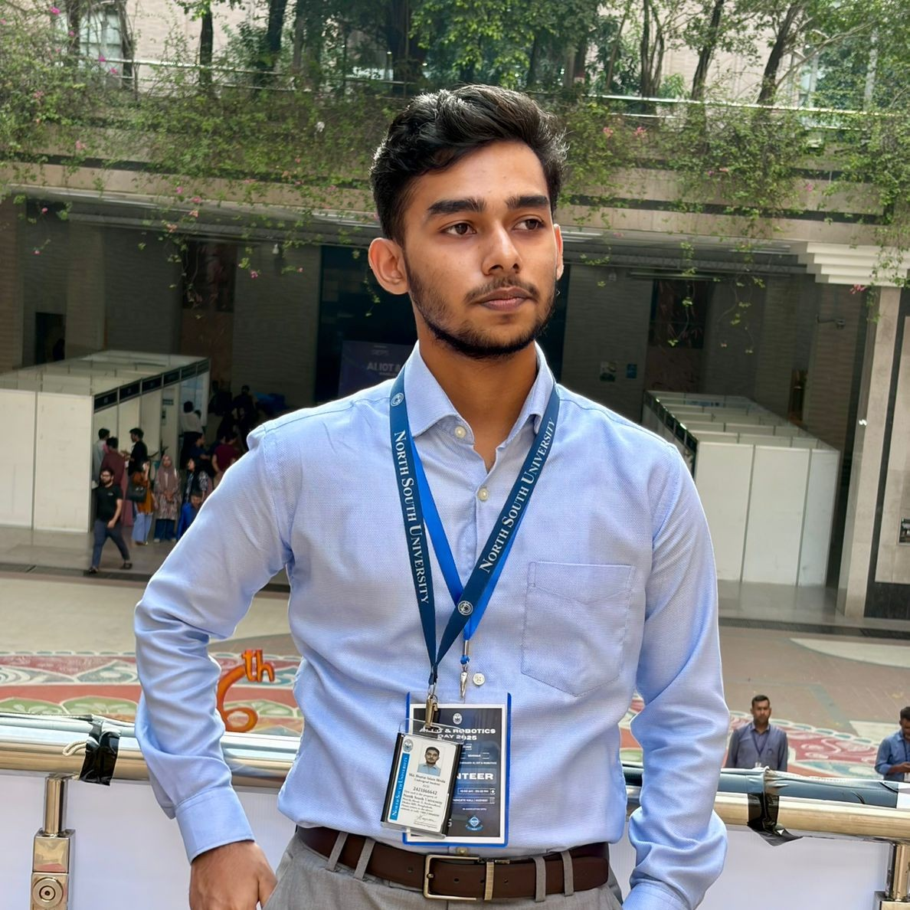

  

  # Md. Shariar Islam Mrida
  **Student at North South University**

  [LinkedIn](https://www.linkedin.com/in/shariar-mrida) • [GitHub](https://github.com/shariar-mrida) • [LeetCode](https://leetcode.com/u/ShariarMrida) • [Facebook](https://www.facebook.com/shariar.mrida) • [Instagram](https://www.instagram.com/shariar.mrida?igsh=MTc3YnAwaTBkbXp4ag==) • [X (Twitter)](https://x.com/Shariar_Mrida?t=xnHFLkSDeMXEFhHyd4y8Fg&s=09) • [ResearchGate](https://www.researchgate.net/profile/Md-Shariar-Mrida)

---

## 🛠 Skills

| **Technical Skills** | **Soft Skills** |
| :--- | :--- |
| • C, C++, Java, JS, Python • MySQL (SQL) • HTML • Git, GitHub • Figma, Canva, Adobe Express • Word, Excel, PowerPoint | • Teaching • Effective Communicator • Patient Mentor • Self-Motivated Learner • Strong Subject Knowledge • Analytical Thinker • Collaborative Team Player |

---

## 💼 Experience

### NSU ACM Student Chapter
**Mentor of R&D Group** | *2025 - Present*
* Conducted academic sessions and coding workshops, developed learning resources.
* Guided peers in CSE-related courses and mentored teams for competitions.
* Collaborated on faculty-led research projects to foster a strong peer-to-peer mentorship culture.

### InverseMe
**Community and Outreach Coordinator** | *2025 - Present*
* Coordinated outreach campaigns across social media, forums, and targeted communities to attract new users.

### Smart Study Academy
**ICT Instructor** | *2024*
* Taught the ICT subject to HSC-level students, covering topics such as Computer Fundamentals, Number System, Computer Networking, HTML, and C Programming.

### Private Tutor
**Math and Science** | *2020 - 2024*
* Provided one-on-one tutoring in Math and Science to secondary-level English-medium students.

---

## 🎓 Education

### North South University
**Bachelor of Science in Computer Science and Engineering** | *2024 - 2028*
* Studying with a 25% Scholarship

### Uttara High School And College
**Higher Secondary Certificate (Science)** | *2021 - 2023*

### Uttara High School and College
**Secondary School Certificate (Science)** | *2019 - 2021*

---

## 📞 Contact

* **Phone:** 01552431702 / 01799667071
* **Email:** [shariarmrida03@gmail.com](mailto:shariarmrida03@gmail.com)
* **Alt Email:** [shariar.mrida.242@northsouth.edu](mailto:shariar.mrida.242@northsouth.edu)
* **Address:** Uttara, Dhaka-1230

---

  &copy; 2025 Md. Shariar Islam Mrida. All rights reserved.

